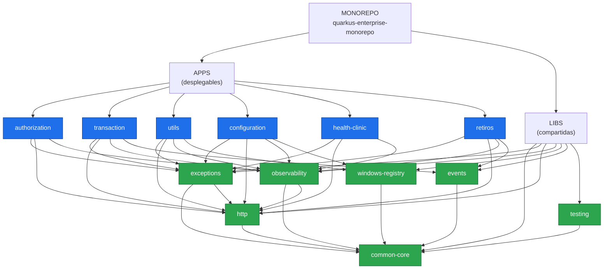

# quarkus-enterprise-monorepo

Monorepositorio empresarial de referencia con **Apache Maven + Quarkus**,
arquitectura hexagonal, librerías compartidas, CI selectivo por proyectos
afectados y fronteras arquitectónicas verificadas automáticamente.

> **Monorepo NO significa monolito.**
> Seis aplicaciones comparten repositorio, build y librerías técnicas.
> No comparten proceso, base de datos, configuración, ciclo de vida ni escalado.

| | |
|---|---|
| **Java** | 21 (LTS) |
| **Quarkus** | 3.20.6 (LTS) |
| **Maven** | 3.9+ (vía `./mvnw`) |
| **Módulos** | 6 aplicaciones + 7 librerías |
| **Estado del build** | `./mvnw clean verify` → 127 tests, 0 fallos |

---

## 1. Qué es esto

Una estructura de referencia completa y **compilable** para enseñar a un
equipo cómo organizar un monorepositorio empresarial. El código de negocio es
deliberadamente trivial: lo que se demuestra es la **organización**.

Lo que esta PoC responde:

- Cómo se reparte un monorepo entre aplicaciones desplegables y librerías.
- Cómo se impide, de verdad y no por convención, que dos microservicios se
  acoplen.
- Cómo se evita que el tiempo de CI crezca con el tamaño del repositorio.
- Cómo se reutiliza código técnico sin crear un framework interno.
- Cómo se organiza cada aplicación por dentro con arquitectura hexagonal.

---

## 2. Estructura

```text
quarkus-enterprise-monorepo/
│
├── pom.xml                      Parent POM + Aggregator POM
│
├── apps/                        Aplicaciones desplegables
│   ├── pom.xml                  Agregador + stack Quarkus común + reglas
│   ├── authorization/
│   ├── transaction/
│   ├── utils/
│   ├── configuration/
│   ├── health-clinic/
│   └── retiros/
│
├── libs/                        Librerías internas compartidas
│   ├── pom.xml                  Agregador + Jandex + regla libs → apps
│   ├── common-core/
│   ├── exceptions/
│   ├── http/
│   ├── observability/
│   ├── windows-registry/
│   ├── events/
│   └── testing/
│
├── infrastructure/
│   ├── docker/                  docker-compose con los 6 servicios
│   ├── kubernetes/              1 Deployment + Service + ConfigMap por app
│   └── openshift/               Route y BuildConfig de ejemplo
│
├── docs/
│   ├── architecture/            Visión general, hexagonal, affected projects
│   ├── adr/                     7 Architecture Decision Records
│   └── c4/                      Diagramas C4 de contexto y contenedores
│
├── scripts/
│   ├── affected-projects.sh     Git diff → módulos afectados
│   ├── affected-projects.ps1    Equivalente para Windows
│   ├── build-affected.sh        Construye solo lo afectado
│   ├── verify-architecture.sh   Verifica las fronteras
│   └── new-module.sh            Scaffolding de app o librería
│
├── .github/
│   ├── workflows/               pull-request, build, security, release
│   └── CODEOWNERS               Propiedad del código por ruta
│
├── .mvn/
├── mvnw
└── mvnw.cmd
```

---

## 3. Diagrama de alto nivel



**Todas las flechas que salen de un nodo azul terminan en un nodo verde.**
No hay ni una flecha entre nodos azules. Esa ausencia es el invariante
principal del repositorio.

---

## 4. Aplicaciones

| Aplicación      | Paquete                     | API base              | Puerto | Libs extra              |
|-----------------|-----------------------------|-----------------------|--------|-------------------------|
| `authorization` | `com.example.authorization` | `/api/authorizations` | 8081   | –                       |
| `transaction`   | `com.example.transaction`   | `/api/transactions`   | 8082   | `lib-events`            |
| `utils`         | `com.example.utils`         | `/api/utils`          | 8083   | `lib-windows-registry`  |
| `configuration` | `com.example.configuration` | `/api/configurations` | 8084   | `lib-windows-registry`  |
| `health-clinic` | `com.example.healthclinic`  | `/api/patients`       | 8085   | –                       |
| `retiros`       | `com.example.retiros`       | `/api/retiros`        | 8086   | `lib-events`            |

Todas exponen el mismo par de operaciones dummy:

```http
GET  /api/<recurso>/{id}     200 | 404 | 422
POST /api/<recurso>          201 | 400
GET  /q/health               sondas de Kubernetes
```

Las tres librerías comunes (`exceptions`, `http`, `observability`) se
declaran **una sola vez** en `apps/pom.xml`. Por eso el `pom.xml` de cada
aplicación cabe en veinte líneas.

---

## 5. Librerías

| Librería           | Responsabilidad                                   | Depende de          |
|--------------------|---------------------------------------------------|---------------------|
| `common-core`      | Java puro: `TimeProvider`, `Ids`, `Preconditions` | –                   |
| `exceptions`       | Jerarquía de errores + Problem Details RFC 7807   | common-core, http   |
| `http`             | Cabeceras, correlation id, filtros JAX-RS         | common-core         |
| `observability`    | MDC, log estructurado, interceptor `@Observed`    | common-core, http   |
| `windows-registry` | Registro de Windows tras una interfaz             | common-core         |
| `events`           | Contratos de eventos de integración               | common-core         |
| `testing`          | Reglas ArchUnit, builders, fixtures (scope `test`)| common-core         |

Lo relevante no es la lista, sino **cuánto recibe una aplicación sin escribir
código**:

| Capacidad                        | Qué hace la aplicación               |
|----------------------------------|--------------------------------------|
| Contrato de error HTTP uniforme  | Nada: los mappers se autorregistran  |
| Correlation id y request id      | Nada: filtros autorregistrados       |
| `traceId` en todos los logs      | Nada: filtro MDC autorregistrado     |
| Medir un caso de uso             | Anotar el método con `@Observed`     |
| Leer el Registro de Windows      | Inyectar `WindowsRegistryReader`     |
| Reglas de arquitectura           | Un test de ocho líneas               |

Esa autoconfiguración es posible gracias al índice Jandex
([ADR 0004](docs/adr/0004-jandex-para-descubrimiento-cdi.md)).

---

## 6. Reglas arquitectónicas

```text
apps -> libs       PERMITIDO
libs -> libs       PERMITIDO DE FORMA CONTROLADA
apps -> apps       PROHIBIDO
libs -> apps       PROHIBIDO
```

Y dentro de cada aplicación:

```text
Infrastructure  ->  Application  ->  Domain
```

`domain` no depende de Quarkus, JAX-RS, JPA, CDI ni Jackson. `application`
tampoco: el servicio de aplicación es una clase Java normal que se publica
como bean desde `infrastructure/config`.

### Tres mecanismos, no uno

| Nivel     | Herramienta    | Qué detecta                                     |
|-----------|----------------|-------------------------------------------------|
| POM       | Maven Enforcer | La dependencia declarada, incluso transitiva    |
| Código    | ArchUnit       | El acoplamiento real entre paquetes             |
| Revisión  | CODEOWNERS     | El cambio de una frontera sin el equipo adecuado|

Las ocho reglas ArchUnit viven una sola vez en `libs/testing` y se ejecutan
en las seis aplicaciones:

```java
HexagonalArchitectureRules.dependenciesPointInwards(BASE_PACKAGE)
HexagonalArchitectureRules.domainIsFrameworkFree(BASE_PACKAGE)
HexagonalArchitectureRules.applicationIsFrameworkFree(BASE_PACKAGE)
HexagonalArchitectureRules.innerLayersIgnoreTransportConcerns(BASE_PACKAGE)
HexagonalArchitectureRules.outboundAdaptersImplementOutputPorts(BASE_PACKAGE)
HexagonalArchitectureRules.restResourcesLiveInTheInboundAdapter(BASE_PACKAGE)
HexagonalArchitectureRules.jpaEntitiesStayInPersistence(BASE_PACKAGE)
MonorepoDependencyRules.noDependenciesOnOtherApplications(BASE_PACKAGE)
```

Comprobarlo todo de una vez:

```bash
scripts/verify-architecture.sh
```

---

## 7. Compilar

### Todo el monorepo

```bash
./mvnw clean verify
```

Construye las 7 librerías y las 6 aplicaciones en el orden que calcula el
Reactor, ejecuta los tests unitarios, los de arquitectura, los de integración
`@QuarkusTest` y genera los informes de JaCoCo.

### Una sola aplicación

```bash
./mvnw -pl apps/authorization -am verify
```

`-am` incluye automáticamente `lib-exceptions`, `lib-http`,
`lib-observability` y `lib-common-core`, porque `authorization` las necesita.

### Las tres banderas del Reactor

| Bandera | Nombre largo               | Qué añade al conjunto            |
|---------|----------------------------|----------------------------------|
| `-pl`   | `--projects`               | Nada: son los módulos semilla    |
| `-am`   | `--also-make`              | Sus **dependencias** (upstream)  |
| `-amd`  | `--also-make-dependents`   | Sus **dependientes** (downstream)|

```bash
# Compilar authorization: hay que construir antes sus librerías
./mvnw -pl apps/authorization -am verify

# He tocado exceptions: ¿qué se rompe? Las 6 aplicaciones
./mvnw -pl libs/exceptions -amd verify

# El conjunto completo. Esto es lo que ejecuta CI
./mvnw -pl libs/exceptions -am -amd verify
```

Comprobación real en este repositorio:

```text
-pl libs/events -am -amd   ->  4 módulos  (common-core, events, transaction, retiros)
-pl libs/exceptions -am -amd -> 9 módulos (common-core, http, exceptions + las 6 apps)
```

---

## 8. Tests

```bash
./mvnw test                                      # unitarios
./mvnw verify                                    # + integración + JaCoCo
./mvnw -pl apps/transaction test                 # solo una aplicación
./mvnw test -Dtest=ArchitectureTest              # solo arquitectura
```

Tres niveles por aplicación:

| Test                  | Qué cubre                                 | Arranca Quarkus |
|-----------------------|-------------------------------------------|-----------------|
| `XServiceTest`        | El caso de uso con puertos falsos         | No (ms)         |
| `ArchitectureTest`    | Las ocho reglas de fronteras              | No              |
| `XResourceTest`       | REST → puerto → servicio → BD, y errores  | Sí (`@QuarkusTest`) |

`XServiceTest` es la demostración práctica del hexágono: implementa los
puertos de salida con lambdas y prueba la lógica sin base de datos, sin
contenedor y sin CDI.

---

## 9. Levantar una aplicación

### Modo desarrollo (hot reload)

```bash
./mvnw -pl apps/authorization -am quarkus:dev
```

### Como JAR

```bash
./mvnw -pl apps/authorization -am package
java -jar apps/authorization/target/quarkus-app/quarkus-run.jar
```

### Probar

```bash
curl -i http://localhost:8081/api/authorizations/A-0001
curl -i http://localhost:8081/api/authorizations/NO-EXISTE     # Problem Details 404
curl -i http://localhost:8081/api/authorizations/A-0002        # Problem Details 422
curl -i -X POST http://localhost:8081/api/authorizations \
     -H 'Content-Type: application/json' \
     -d '{"label":"nueva","limitAmount":500.00}'
curl -i http://localhost:8081/q/health
```

Respuesta de error (RFC 7807):

```json
{
  "type": "https://errors.example.com/auth-0001",
  "title": "Authorization no encontrado",
  "status": 404,
  "detail": "No existe Authorization con identificador NO-EXISTE",
  "instance": "/api/authorizations/NO-EXISTE",
  "traceId": "0f1c9a4e-...",
  "code": "AUTH-0001",
  "timestamp": "2026-02-10T09:12:44Z"
}
```

Ninguna de las seis aplicaciones escribe un solo `ExceptionMapper`.

### Las seis a la vez

```bash
./mvnw clean package -DskipTests
docker compose -f infrastructure/docker/docker-compose.yml up --build
```

### Imagen de una aplicación

```bash
./mvnw -pl apps/transaction -am package -DskipTests
docker build -f apps/transaction/src/main/docker/Dockerfile.jvm \
             -t example/transaction:local apps/transaction
```

```text
MONOREPO
   ├── authorization → JAR → Container
   ├── transaction   → JAR → Container
   ├── utils         → JAR → Container
   ├── configuration → JAR → Container
   ├── health-clinic → JAR → Container
   └── retiros       → JAR → Container
```

---

## 10. Affected Projects

El objetivo: que el tiempo de CI dependa del **tamaño del cambio**, no del
tamaño del repositorio.

```text
Git Diff
   │
   ▼
Detect Changed Projects        scripts/affected-projects.sh
   │
   ▼
Calculate Dependency Graph     Maven Reactor
   │
   ▼
Determine Affected Projects    -am (upstream) + -amd (downstream)
   │
   ▼
Build / Test only affected projects
```

El reparto de responsabilidades es intencionado: **git** sabe qué ficheros
han cambiado, **Maven** conoce el grafo de dependencias. El script traduce
ficheros a módulos semilla y deja que el Reactor calcule el cierre
transitivo; no reimplementa el grafo.

```bash
scripts/affected-projects.sh --base origin/main --format list
scripts/affected-projects.sh --base origin/main --format maven
#   -> -pl libs/exceptions -am -amd

scripts/build-affected.sh --base origin/main verify
```

Ejemplo: cambia `libs/exceptions`.

```text
Semilla   (-pl)   libs/exceptions
Upstream  (-am)   libs/common-core, libs/http
Downstream(-amd)  authorization, transaction, utils, configuration,
                  health-clinic, retiros
```

Cambia `libs/events`: solo 4 módulos, porque solo `transaction` y `retiros`
lo consumen ([ADR 0006](docs/adr/0006-contratos-de-eventos-compartidos.md)).

**Red de seguridad:** el cálculo es una optimización, no una garantía. Por
eso `build.yml` ejecuta el reactor completo en cada push a `main` y cada
noche. Detalle completo en
[docs/architecture/affected-projects.md](docs/architecture/affected-projects.md).

---

## 11. CI/CD

| Workflow           | Disparador             | Qué hace                                        |
|--------------------|------------------------|-------------------------------------------------|
| `pull-request.yml` | PR a `main`            | Solo lo afectado, en cuatro jobs encadenados    |
| `build.yml`        | Push a `main` + nocturno | Reactor completo + 6 imágenes en paralelo     |
| `security.yml`     | PR, push, semanal      | Dependency review, CodeQL, SBOM CycloneDX       |
| `release.yml`      | Manual                 | `versions:set`, verify, tag, 6 imágenes         |

El pipeline de Pull Request:

```text
Pull Request
     │
     ▼
Detect Changes  ──►  Affected Projects
     │
     ▼
Compile  ─►  Unit Tests  ─►  Architecture Tests  ─►  JaCoCo
     │
     ▼
Static Analysis  ─►  Security  ─►  Package
```

Los tests de arquitectura se ejecutan en un paso propio para que una
violación de frontera aparezca como un check identificable en el PR, y no
enterrada entre los tests funcionales.

### CODEOWNERS

En un monorepo la propiedad del código no la da el repositorio: la da la
ruta. `.github/CODEOWNERS` asigna revisores distintos a
`/apps/authorization`, `/apps/transaction`, `/apps/retiros`, `/libs` e
`/infrastructure`. Las librerías requieren además la revisión de
arquitectura, porque un cambio ahí impacta a varias aplicaciones a la vez.

---

## 12. Añadir una aplicación nueva

```bash
scripts/new-module.sh app billing com.example.billing
```

El script crea el esqueleto hexagonal completo y registra el módulo en
`apps/pom.xml`. Después, cuatro pasos manuales:

1. Añadir `com.example.billing` a `MonorepoPackages.APPLICATIONS` en
   `libs/testing`, para que la regla `apps → apps` tenga en cuenta la nueva
   aplicación.
2. Asignar propietario en `.github/CODEOWNERS`.
3. Crear `infrastructure/kubernetes/base/billing.yaml`.
4. Añadirla a la matriz de `.github/workflows/build.yml`.

Lo que **no** hay que hacer: declarar la versión, el stack Quarkus, los
plugins, JaCoCo, Surefire ni las librerías comunes. Todo eso lo hereda de
`apps/pom.xml` y del POM raíz.

---

## 13. Añadir una librería nueva

Antes de crearla, cuatro preguntas:

1. ¿La necesitan **dos o más** aplicaciones hoy, no en teoría?
2. ¿Es **técnica**, no de negocio?
3. ¿Es **estable**? Una librería que cambia cada sprint convierte cada cambio
   en un despliegue coordinado de seis servicios.
4. ¿Cabe en una librería existente?

Si las cuatro respuestas son afirmativas:

```bash
scripts/new-module.sh lib caching
```

Después:

1. Declarar su versión en el `dependencyManagement` del POM raíz.
2. Asignar propietario en `.github/CODEOWNERS`.

Hereda automáticamente Jandex, JUnit y la regla `libs → apps`.

---

## 14. Documentación

| Documento | Contenido |
|-----------|-----------|
| [architecture/overview.md](docs/architecture/overview.md) | Mapa de módulos, reglas, flujo de una petición |
| [architecture/hexagonal-architecture.md](docs/architecture/hexagonal-architecture.md) | Convenciones de paquetes y nomenclatura |
| [architecture/affected-projects.md](docs/architecture/affected-projects.md) | El algoritmo en detalle |
| [c4/context.md](docs/c4/context.md) · [c4/container.md](docs/c4/container.md) | Diagramas C4 |
| [adr/](docs/adr/) | Siete decisiones con su contexto y consecuencias |

Los ADR más útiles para una sesión de formación:

- [0003 – Separación estricta entre apps y libs](docs/adr/0003-separacion-apps-libs.md)
- [0004 – Jandex en lugar de beans.xml](docs/adr/0004-jandex-para-descubrimiento-cdi.md)
- [0006 – Cuándo compartir un contrato de evento](docs/adr/0006-contratos-de-eventos-compartidos.md)

---

## 15. Puesta en marcha

```bash
git clone <url> && cd quarkus-enterprise-monorepo
./mvnw clean verify                 # 13 módulos, 127 tests
./mvnw -pl apps/authorization -am quarkus:dev
curl http://localhost:8081/api/authorizations/A-0001
```

Requisitos: **JDK 21** y Docker (opcional, solo para `docker compose`).
Maven lo aporta el wrapper; el Enforcer rechaza el build con cualquier otra
versión de Java.
