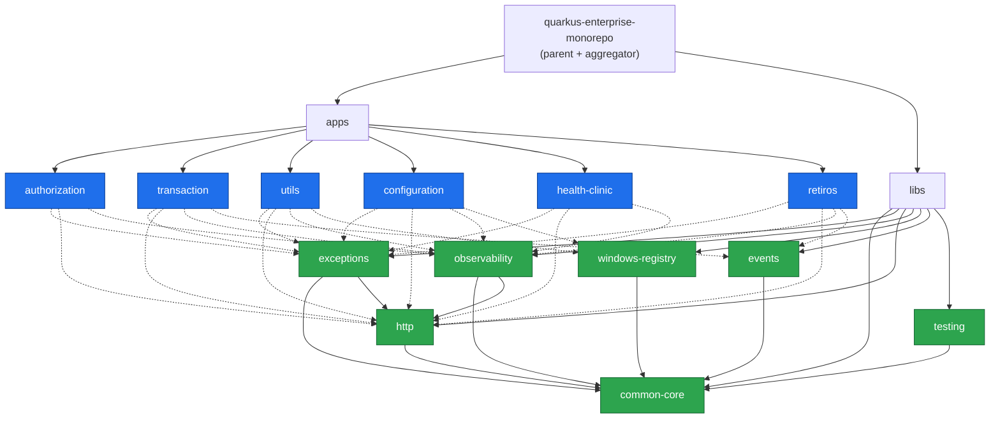

# Vision general de la arquitectura

## 1. Dos ciudadanos de primera clase

El monorepo tiene exactamente dos tipos de modulo, y la distincion es
deliberada:

| Tipo      | Carpeta  | Packaging           | Se despliega | Quien lo construye      |
|-----------|----------|---------------------|--------------|-------------------------|
| Aplicacion| `apps/`  | Quarkus runner jar  | Si           | `quarkus-maven-plugin`  |
| Libreria  | `libs/`  | jar plano + Jandex  | No           | `maven-jar-plugin`      |

Todo lo que no encaje en una de las dos categorias no deberia entrar en el
repositorio sin una ADR que lo justifique.

## 2. Mapa de modulos



Linea discontinua = dependencia `apps -> libs`.
Entre los seis nodos azules **no hay ni una sola flecha**: esa ausencia es el
invariante mas importante de todo el repositorio.

## 3. Reglas de dependencia

```text
apps -> libs       PERMITIDO
libs -> libs       PERMITIDO DE FORMA CONTROLADA
apps -> apps       PROHIBIDO
libs -> apps       PROHIBIDO
```

Se verifican en tres niveles, y los tres son necesarios:

| Nivel        | Herramienta      | Que detecta                                        |
|--------------|------------------|----------------------------------------------------|
| POM          | Maven Enforcer   | La dependencia declarada, incluida la transitiva   |
| Codigo       | ArchUnit         | El acoplamiento real entre paquetes                |
| Revision     | CODEOWNERS       | El cambio de una frontera sin el equipo adecuado   |

"Controlado" en `libs -> libs` significa que el grafo es un DAG poco profundo
y documentado:

```text
common-core  <- http  <- exceptions
common-core  <- http  <- observability
common-core  <- windows-registry
common-core  <- events
common-core  <- testing
```

`common-core` no depende de nada y no tiene ni una anotacion de framework.
Es la unica libreria que el dominio de una aplicacion puede usar sin matices.

## 4. Arquitectura hexagonal dentro de cada aplicacion

```mermaid
flowchart TB
    subgraph INFRA["infrastructure (adaptadores)"]
        REST["adapter/in/rest<br/>XResource"]
        PERS["adapter/out/persistence<br/>XPersistenceAdapter"]
        MSG["adapter/out/messaging<br/>XEventPublisher"]
        CONF["config<br/>XBeanConfiguration"]
        REPO["persistence/repository + entity + mapper"]
    end

    subgraph APP["application (casos de uso)"]
        PIN["port/in<br/>GetXUseCase / CreateXUseCase"]
        SVC["service<br/>XService"]
        POUT["port/out<br/>LoadXPort / SaveXPort / XEventPublisherPort"]
        DTO["dto + mapper"]
    end

    subgraph DOM["domain (Java puro)"]
        MODEL["model<br/>X, XId, XStatus"]
        POLICY["service<br/>XPolicy"]
        DEX["exception<br/>XNotFoundException"]
    end

    REST --> PIN
    PIN  --- SVC
    SVC  --> POUT
    SVC  --> DTO
    SVC  --> MODEL
    SVC  --> POLICY
    POUT <-.implementa.- PERS
    POUT <-.implementa.- MSG
    PERS --> REPO
    CONF -.crea.-> SVC
    POLICY --> DEX

    classDef dom fill:#8250df,stroke:#4c1d95,color:#fff;
    classDef app fill:#1f6feb,stroke:#0b3d91,color:#fff;
    classDef inf fill:#bf8700,stroke:#7a5600,color:#fff;
    class MODEL,POLICY,DEX dom;
    class PIN,SVC,POUT,DTO app;
    class REST,PERS,MSG,CONF,REPO inf;
```

Direccion de la dependencia:

```text
Infrastructure  ->  Application  ->  Domain
```

Nunca al reves. Lo garantiza `HexagonalArchitectureRules.dependenciesPointInwards`.

### Flujo de una peticion

```text
GET /api/authorizations/A-0001
        |
        v
AuthorizationResource            (infrastructure/adapter/in/rest)
        |
        v
GetAuthorizationUseCase          (application/port/in)
        |
        v
AuthorizationService             (application/service)
        |
        v
LoadAuthorizationPort            (application/port/out)
        |
        v
AuthorizationPersistenceAdapter  (infrastructure/adapter/out/persistence)
        |
        v
AuthorizationJpaRepository       (infrastructure/persistence/repository)
        |
        v
AuthorizationEntity              (infrastructure/persistence/entity)
```

Y de vuelta, `AuthorizationPersistenceMapper` convierte la entidad en el
agregado de dominio, y `AuthorizationDtoMapper` convierte el agregado en el
DTO de respuesta. Son dos conversiones explicitas, no un descuido.

## 5. Dominio y persistencia separados

```text
Domain Model           Mapper                       JPA Entity
------------           ------                       ----------
Authorization   <-->   AuthorizationPersistence  <-->  AuthorizationEntity
  AuthorizationId         Mapper                         String id
  AuthorizationStatus                                    String status
  BigDecimal limitAmount                                 BigDecimal limitAmount
  Instant createdAt                                      Instant createdAt
```

El agregado valida sus invariantes en el constructor; la entidad es una
estructura de datos anotada. El `status` viaja como `String` en la entidad y
como enum en el dominio justamente para dejar claro que son dos modelos y no
uno con dos nombres.

## 6. Donde vive cada responsabilidad transversal

| Necesidad                       | Donde esta               | Como la usa una aplicacion                |
|---------------------------------|--------------------------|-------------------------------------------|
| Contrato de error HTTP          | `libs/exceptions`        | No hace nada: los mappers se autoregistran|
| Correlation / request id        | `libs/http`              | No hace nada: filtros autoregistrados     |
| traceId en los logs             | `libs/observability`     | No hace nada: filtro MDC autoregistrado   |
| Medir un caso de uso            | `libs/observability`     | Anotar el metodo con `@Observed`          |
| Leer el Registro de Windows     | `libs/windows-registry`  | Inyectar `WindowsRegistryReader`          |
| Contrato de evento compartido   | `libs/events`            | Solo en el adaptador de salida            |
| Reglas de arquitectura          | `libs/testing`           | Un `ArchitectureTest` de 8 lineas         |

La columna de la derecha es la que importa: casi todo el valor llega sin que
el equipo de producto escriba codigo de plataforma.
