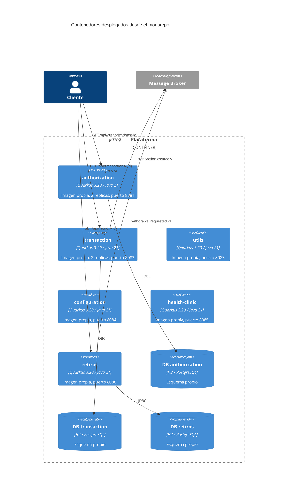

# C4 - Nivel 2: Contenedores



## Lo que este diagrama demuestra

Un contenedor por aplicacion, una base de datos por aplicacion, un ciclo de
despliegue por aplicacion:

```text
MONOREPO
   |
   +-- authorization -> JAR -> Container -> Deployment (2 replicas)
   +-- transaction   -> JAR -> Container -> Deployment (2 replicas)
   +-- utils         -> JAR -> Container -> Deployment
   +-- configuration -> JAR -> Container -> Deployment
   +-- health-clinic -> JAR -> Container -> Deployment
   +-- retiros       -> JAR -> Container -> Deployment
```

**Monorepo NO significa monolito.** Lo que se comparte es el repositorio, el
build y las librerias tecnicas. Lo que no se comparte: el proceso, la base de
datos, la configuracion, el ciclo de vida y el escalado.

## Librerias: componentes, no contenedores

`libs/*` no aparece en este diagrama porque ninguna libreria es un
contenedor. Son componentes (nivel 3 de C4) que acaban empaquetados dentro de
cada imagen:

```text
authorization.jar
  +-- lib-exceptions.jar
  +-- lib-http.jar
  +-- lib-observability.jar
  +-- lib-common-core.jar
```

Confundir una libreria compartida con un servicio compartido es el error
clasico al dibujar la arquitectura de un monorepo.
