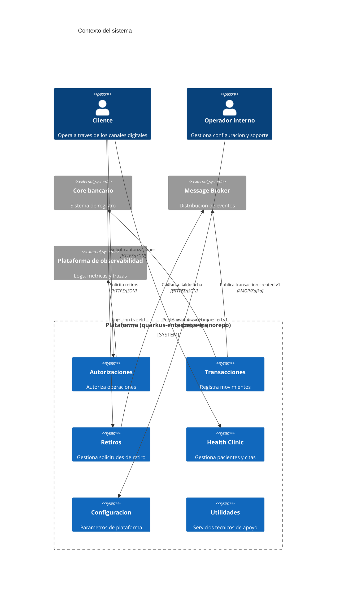

# C4 - Nivel 1: Contexto

Nota importante: **ningun servicio de la plataforma llama directamente a
otro** en este diagrama. La comunicacion, cuando existe, es por eventos a
traves del broker. Eso es lo que hace cierta la regla `apps -> apps
PROHIBIDO` tambien en tiempo de ejecucion, y no solo en el POM.
